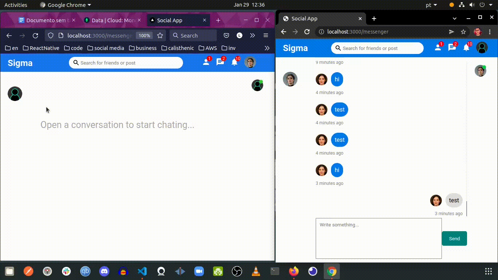

<h1 align="center">
   
</h1>

 

# Sigma

Application with the purpose of connecting people all over the world  
inspired by facebook app 

Developed with <code>ReactJS</code>, <code>NodeJs</code>,<code>Axios</code>, <code>Express</code>, <code>Bcrypt</code>,<code>Mongoose</code>  <code>Socket.io</code> and <code>Context Api</code>  
 

# About the project

 
   So far it has the following features: `Register`, `login`, `post images` and  give a `like`. In the home, the posts of the logged in user and the people he follows are fetched.  
   In addition, it is possible to `follow users` and chat in real time through socket.io and finally, users who are online are shown.  

## Realtime chat

 First of all, what's socket.io ?  
    Socket.io is a technology that allows you to start bi-directional cummunication session between the browser and the server. Thanks to this protocol it is possibility to send request to the server and receive an answer as events, what means that you don't have to re-send the request to the server. 
 For this realtime chat application with socket, we have a socket server when some user connects to the application they will be connected   with the socket server and they will have their own socketID. There is no DB on the server, it is not saving any data or reading from any DB, just connecting with the computer and using only events. Connecting with PC means, in short, that the socket server uses TCP/IP connection. Let's suppose that a user “A” wants to send an event to user B, so user A will send a message event to the server, he takes it this event and checks: “ok..this is a message event” and it came from socketIDA, for example, and the receiver is B. That way, instantly the message will be set on socketA. So sender will be A and text will have the message sent.

 

## Upload image

  I used multer for this purpose, that's not a good idea, I know. I plan to later switch to Firebase or Amazon Services

# To-do lists
 
<ol>
 <li>Make the SM Responsive </li>
 <li>Add comment functionality </li>
 <li>Add delete and edit posts functionality</li>
</ol>

## :camera: See the app's features:

<h2>Realtime Chat With Socket.io </h2>

<h2>Post </h2>

<h2>All pages until now</h2>

## Getting started

1. Clone this repo using `git@github.com:eulazzo/socialmedia.git`
2. Move yourself to the appropriate directory: `cd socialmedia` 
3. Run `npm install` to install dependencies 

### Getting started with the frontend

1. Move yourself to the frontend folder: `cd client`  
2. Run `npm start` or `yarn start` to start the web application  
a window will open, but for the data show up, we have to start the back-end server

### Getting started with the backend server

1. Move yourself to the backend folder: `cd api`
2. Create a `.env` file and add the MongoDB url connection in MONGO_URL field
3. Now type yarn run dev, the server will start with nodemon 
4. if you dont have yarn installed, type <code> npm install --global yarn </code> on terminal to install it or just use npm instead  

### Getting started with Socket.io
1. Move yourself to the socket io folder: `cd socket`
2. Go to socket folder and type again <code>npm start</code> for the chat message works properly  
3. now you are ready to create an account and login

## :rocket: Technologies

<table>
   
  <thead>
    <th>Back-end</th>
    <th>Front-end</th>
  </thead>
   
  <tbody>
    <tr>
      <td>Node.js</td>
      <td>ReactJS</td>
    </tr>
     <tr>
      <td>Socket.io</td>
      <td>Socket.io</td>
    </tr>
    <tr>
      <td>ExpressJs</td>
      <td>CSS</td>
    </tr>
    <tr>
      <td>Axios</td>
      <td>Axios</td>
    </tr>
    <tr>
      <td>Nodemon</td>
      <td>React Hooks</td>
    </tr>
    <tr>
      <td>Cors</td>
      <td>Eslint</td>
    </tr>
    <tr>
      <td>Prettier</td>
      <td>Prettier</td>
    </tr>
  </tbody>
  
</table>

## License

This project is licensed under the MIT License - see the [LICENSE](https://opensource.org/licenses/MIT) page for details.
<!-- <h4>Techs:</h4>

  

  -->

 

 
 
