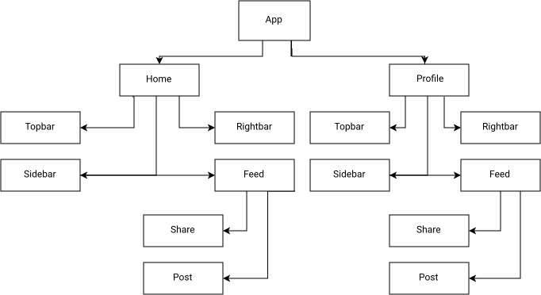
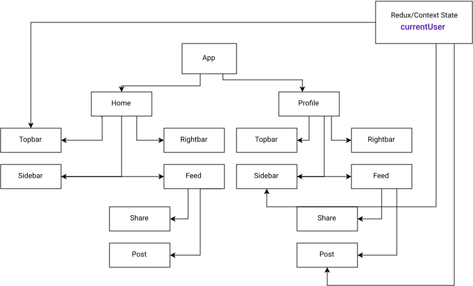

<h1 align="center">
   
</h1>
  
<div align="center">
  <h1>Implly - Everybody has something <b>GOOD</b> to <b>SHARE</b> </h1>
</div>

<p align="center" >
  <a href="#about"> About </a> &nbsp;&nbsp;&nbsp;| &nbsp;&nbsp;&nbsp;
  <a href="#realtime-chat">Realtime chat</a> &nbsp;&nbsp;&nbsp;|&nbsp;&nbsp;&nbsp;
  <a href="#application-features">Gifs</a> &nbsp;&nbsp;&nbsp;|&nbsp;&nbsp;&nbsp;
  <a href="#getting-started">Getting started </a> &nbsp;&nbsp;&nbsp;|&nbsp;&nbsp;&nbsp;
  <a href="#techs">Techs</a> &nbsp;&nbsp;&nbsp;|&nbsp;&nbsp;&nbsp;
  <a href="#license">License</a>
</p>


<p align="center">
  <a href="https://github.com/eulazzo" target="_blank">
     
  </a>
    
  
  
</p>


 

</br>

### Topics
* [About the project](#about)
   * [Features](#features)
   * [Realtime chat](#realtime-chat)
   * [Socket.io in this project](#socketio-in-this-project)
* [What's ContextAPIs and why was used in this project](#whats-contextapis-and-why-was-used-in-this-project)
   * [Diagram application structure](#diagram-application-structure)
   * [Diagram exemple how ContextAPI works](#diagram-exemple-how-contextapi-works) 
   * [Upload image](#upload-image) 
   * [GIFS - Application features](#application-features) 
* [Getting started](#getting-started)
* [Techs](#techs)
* [License](#license) 

# About

### Implly - Everybody has something GOOD to SHARE

<p>
Application with the purpose of connecting people who have common interests to
share good contents. Just create your account and choose what your
interests are and start to have access to the best that Implly have to offer. (Not implemented yet)
</p>
 
<p>Developed with <code>ReactJS</code>, <code>NodeJs</code>,<code>Axios</code>,</br><code>Express</code>, <code>Bcrypt</code>,<code>Mongoose</code>  <code>Socket.io</code> and <code>Context Api</code>  </p> 

#### Features:
- [X] Register
- [X] Login
- [X] Post images
- [X] Like a post
- [X] On the home page, `the posts of the logged in user and the people he follows are fetched`
- [X] In addition, it is possible to `follow users` and `chat in realtime` through `socket.io` 
- [X] And finally `users who are online are shown` (On the chat page)
- [ ] Make the SM Responsive 
- [ ] Add comment functionality
- [ ] Delete and edit posts functionality
- [ ] Use S3 Storage or Firebase for Upload of images instead of Multer


## Endpoints

* ### signUp
  * Método: POST
  * Path: `/auth/register`
  * input: 
    ```
     {
        "username":"eulazzo",
        "email":"lazaro@gmail.com",
        "password":"LFx23lY9099@0dlsxJAVAscript"
      }
     
    ```
  * Output: (email,password and username is mandatory, will return a error in case one of them is missing)
    ```
     {
	"username": "eulazzo",
	"email": "lazaro@gmail.com",
	"password": "$2b$10$g/0BZi.hLBvtfCOYbUgk/eb/NMxiafXvtzQN6DAaUG3tn3JD6Wm32",
	"profilePicture": "",
	"coverPicture": "",
	"followers": [],
	"followings": [],
	"isAdmin": false,
	"_id": "61901ddb74b46716ce7d4e78",
	"createdAt": "2021-11-13T20:19:39.788Z",
	"updatedAt": "2021-11-13T20:19:39.788Z",
	"__v": 0
      }
    ```

* ### signIn
  * Método: POST
  * Path: `/auth/login`
  * Input
    ```
      {
        "email":"lazaro@gmail.com",
        "password":"LFx23lY9099@0dlsxJAVAscript"
      }
    ```
  * Output: 
    ```
    {
      "_id": "618d4fe252e208102adc923c",
      "username": "eulazzo",
      "email": "lazaro@gmail.com",
      "password": "$2b$10$mlGb3vEcR8e2NMnmh0l1X.rKu9zVSlhLbgV9H22bYlxtkpWtcIHKK",
      "profilePicture": "",
      "coverPicture": "",
      "followers": [
         "618d504752e208102adc9242"
      ],
      "followings": [
         "618d504752e208102adc9242"
      ],
      "isAdmin": false,
      "createdAt": "2021-11-11T17:16:18.074Z",
      "updatedAt": "2021-11-12T20:32:00.237Z",
      "__v": 0,
      "city": "bocaiuva",
      "from": "Brasil",
      "relationship": 1
     }  
    ```


* ### updateUser
  * Método: PUT
  * Path: `/user/:id`
  * Input:
    ```
    {
       "userId": "618a88f06896335dc7de9935",
       "bio":"Nenhuma complexidade resiste ao tempo!"
     } 
    ```
  * Output:
    ```
     {
	"_id": "618a88f06896335dc7de9935",
	"username": "eulazzo5",
        "bio":"Nenhuma complexidade resiste ao tempo!"
	"email": "lazaro@ctemplar.com",
	"password": "$2b$10$rxBjuqVNnZSx89.E8lo9W.d2/zgKCX1zqDKAu/9TRtNMAkb/koIO6",
	"profilePicture": "",
	"coverPicture": "",
	"followers": [],
	"followings": [],
	"isAdmin": false,
	"createdAt": "2021-11-09T14:42:56.029Z",
	"updatedAt": "2021-11-09T14:42:56.029Z",
	"__v": 0
     }
    ```
 
* ### deleteUser
  * Método: DELETE
  * Path: `/user/:id`
  * Input:
    ```
     {
        "userId": "612d7ead84896c060dcf5242"
     }
    ```
  * Output:
    ```
     {
        "Account has been deleted"
     }
    ```
  
* ### getUser
  * Método: GET
  * Path: `/user/`
  * Input:
    ```
      {
	  "userId": "612d7ead84896c060dcf5242"
      }
    ```
  * Output:
    ```
     {
       "_id": "618aa1e62e8d0c99abc5ea25",
       "username": "eulazzo",
       "email": "lazaro@ctemplar.com",
       "profilePicture": "",
       "coverPicture": "",
       "followers": [],
       "followings": [],
       "isAdmin": false,
       "createdAt": "2021-11-09T16:29:26.482Z",
       "__v": 0
     }
    ```
 
* ### createPost
  * Método: POST
  * Path: `/posts`
  * Input:
    ```
     {
       "userId":"618d504752e208102adc9242",
       "desc":"Não há complexidade que resista ao tempo!"
      }  
    ```
  * Ouput
    ```
      {
         "userId": "618d504752e208102adc9242",
         "desc": "Friendship is all",
         "likes": [],
         "_id": "618d506952e208102adc9246",
         "createdAt": "2021-11-11T17:18:33.444Z",
         "updatedAt": "2021-11-11T17:18:33.444Z",
         "__v": 0
      }
     ```
 
* ### getPost
  * Método: GET
  * Path: `/posts/:id`
  * Ouput
    ```
     {
       "_id": "613778b6bd13ec3ecbbd4d34",
       "likes": [],
       "userId": "612d7daf84896c060dcf523a",
       "desc": "Guys, I have learn a lot from. I really recommend you to check it out.",
       "createdAt": "2021-09-07T14:35:34.863Z",
       "updatedAt": "2021-09-07T14:35:34.863Z",
       "__v": 0
      }
    ```
  
* ### updatePost
  * Método: PUT
  * Path: `/posts/:id`
  * Input:  
    ```
      {
        "userId":"618aa1e62e8d0c99abc5ea25",
        "desc":"My first post was updated"
      }
    ```
  * Ouput
    ```
      {
        "The post has been updated"
      }
    ```
  
* ### timelinePosts
  * Método: PUT
  * Path: `/posts/:id`
  * Input:  
    ```
     {
         "userId":"612d7ead84896c060dcf5242"
      }
    ```
  * Ouput
    ```
     [
	{
		"_id": "612d7f2484896c060dcf5244",
		"likes": [],
		"userId": "612d7ead84896c060dcf5242",
		"desc": "Description 1",
		"img": "post/1.jpeg",
		"createdAt": "2021-08-31T01:00:20.928Z",
		"updatedAt": "2021-09-06T17:08:51.183Z",
		"__v": 0
	},
	{
		"_id": "61469618137e41112e11d1ac",
		"likes": [],
		"userId": "612d7ead84896c060dcf5242",
		"desc": "Description 2",
		"img": "1632015896378Felipe.png",
		"createdAt": "2021-09-19T01:44:56.418Z",
		"updatedAt": "2021-09-19T01:44:56.418Z",
		"__v": 0
	},
	{
		"_id": "61469624137e41112e11d1be",
		"likes": [
			"612d7ead84896c060dcf5242",
			"6138ada9f9e1840fd3ff84f5"
		],
		"userId": "612d7ead84896c060dcf5242",
		"desc": "Description 3",
		"img": null,
		"createdAt": "2021-09-19T01:45:08.382Z",
		"updatedAt": "2021-09-19T02:00:21.324Z",
		"__v": 0
	},
	{
		"_id": "613778a4bd13ec3ecbbd4d32",
		"likes": [],
		"userId": "612d7daf84896c060dcf523a",
		"desc": "Description 4",
		"img": "post/1.jpeg",
		"createdAt": "2021-09-07T14:35:16.777Z",
		"updatedAt": "2021-09-07T14:35:16.777Z",
		"__v": 0
	}, 
      ]
    ```
 
* ### getAllFriends
  * Método: GET
  * Path: `/friends/:id`

  * Ouput
    ```
      [
       {
	  "username": "Priscila",
	  "_id": "618d504752e208102adc9242",
	  "profilePicture": ""
        },
       {
	  "username": "Luana",
	  "_id": "324234234236426348729242",
	  "profilePicture": ""
       }
      ]
    ```
 
* ### addMessage
  * Método: POST
  * Path: `/messages`
  * Input:
    ```
      {
	  "conversationId":"618fe4d221c7097aabb36460",
          "senderId":"618d4fe252e208102adc923c",
	  "text":"Hi there! What's up? "
      } 
    ```

  * Ouput
    ```
     {
	"conversationId": "618fe4d221c7097aabb36460",
	"senderId": "618d4fe252e208102adc923c",
	"text": "Hi there! What's up? ",
	"_id": "618fe58221c7097aabb36464",
	"createdAt": "2021-11-13T16:19:14.682Z",
	"updatedAt": "2021-11-13T16:19:14.682Z",
	"__v": 0
      }
    ```
* ### createConversation
  * Método: POST
  * Path: `/conversations`
  * Input:
    ```
       {
	  "senderId":"618d504752e208102adc9242",
	  "receiverId":"618d4fe252e208102adc923c"
       }
     ```

  * Ouput
    ```
    {
	"members": [
		"618d504752e208102adc9242",
		"618d4fe252e208102adc923c"
	],
	"_id": "618fe4d221c7097aabb36460",
	"createdAt": "2021-11-13T16:16:18.094Z",
	"updatedAt": "2021-11-13T16:16:18.094Z",
	"__v": 0
     }
   ```
   
* ### getMessages
  * Método: POST
  * Path: `/conversations`
  * Input:
    ```
        {
	  "conversationId":"618fe4d221c7097aabb36460",
	  "senderId":"612d7ead84896c060dcf5242",
          "text":"I very good, and about you?"
        }
     ```

   * Ouput
     ```
     
        [
	      {
		   "_id": "618fe54221c7097aabb36462",
		    "conversationId": "618fe4d221c7097aabb36460",
		    "senderId": "618d504752e208102adc9242",
		    "text": "Hi, I am lazzaro ",
		    "createdAt": "2021-11-13T16:18:10.888Z",
		    "updatedAt": "2021-11-13T16:18:10.888Z",
	            "__v": 0
		},
		{
		    "_id": "618fe58221c7097aabb36464",
		    "conversationId": "618fe4d221c7097aabb36460",
	 	    "senderId": "618d4fe252e208102adc923c",
		    "text": "Hi, i'm Lorena",
		    "createdAt": "2021-11-13T16:19:14.682Z",
		    "updatedAt": "2021-11-13T16:19:14.682Z",
		    "__v": 0
		}
       ]
     
     ```
  
* ### followUser
  * Método: PUT
  * Path: `/user/:id`
  * Input:
    ```
        {
	   "userId": "618d4fe252e208102adc923c"
	} 
     ```

  * Ouput
    ```
      "user has been followed"
    ```
 
* ### unfollowUser
  * Método: PUT
  * Path: `/user/:id`
  * input:
    ```
       {
	  "userId": "618d4fe252e208102adc923c"
        } 
    ```

  * Ouput
    ```
      "user has been unfollowed"
    ```
 
## Realtime chat
 
 ### What's Socket.Io ?
 <p>
    Socket.io is a technology that allows you to start bi-directional communication session between the browser and the server. Thanks to this protocol it is possible to send request to the server and receive an answer as events, what means that you don't have to re-send the request to the server. </br>
 </p> 
 
 ### Socket.io in this project
   So...For this realtime chat application with socket,basically we have a socket server whenever any user connects to the application  it's gonna connect this socket server and they will have their own socketID, and inside the server there is no DB, it's not writing any data, not reading from any db it's just connecting to your computer and using only events. By saying connecting your computer,in short way, means that the socket server use TCP/IP connection. </br>  
  
 Let's say the user 4, `on the image below`, wants to send an event to user 3, so user 4 is going to send the sendMessage event to the server, he takes it(server) this event and say: “ok..this is a sendMessage event it came from socketID4 and the receiver is 3",for example. That way, instantly the message will be set on socket 3. So sender will be 4 and text will have the message sent.
</p>

<!--    -->

 <h1 >
   
</h1>

# What's ContextAPIs and why was used in this project?
<p>
   Context api provides a way to pass data through the component tree without having to pass props down manually at every level, and can be used for authentication, form data storage.
   For this project, there came a time that i have the feed component where i have fetched the user posts but with <code> static ID</code>. The exemple code below explained better.
   
</p>

```js
      useEffect(()=>{
        const fetchPosts = async () => {
          const { data } = await axios.get("posts/timeline/23453453463634"); 
          setPosts(data);
         }
         fetchPosts()
      },[])
   ```
 <p>But instead of <code> static ID</code>, in this exemple,<code>23453453463634</code>, the app must be able to get the logged in user ID but at the time i didn't have any login or register system. Which Context api was used for it </p>
 
 ### Diagram application structure
 <h1 >
   
</h1>

<p>Until that moment  my application had that structure. I could easily pass data in Home to Topbar component but i can't pass to App.js not even to Post directly. First i should pass to Feed after that to Post. If I created, let's say, a post in Feed, I can only pass that data to the Share and Post component because it's its children, there are some advantages in that because we never conflicts any props. However, there are some disadvantages because, for exemple, when we login to this application we gonna use the <code>CurrentUser</code> on the Header component,Share component, sidebar for show the user friends  and online friends, likes some post and etc, basically we gonna use everywhere. <code> That's the reason ContextAPI</code> was used 
</p>

 
 ### Diagram exemple how ContextAPI works
 <h1>
   
</h1>

<p>
   When a user login in the app, his id, profilePicture, username, email is stored on the ContextAPI(currentUser). So if for exemple, Post component need some data of the user just fecth on Post the data, Or Side bar component needs the profilePicture, not a problem, Maybe Topbar needs userID or username not problem at all. Basically we have a common state that include the currentUser. So whenever the user is necessary, we are not gonna ask the parent anymore, just ask to ContextAPI instead.
   Because it's not a huge application that the data is changed often, and not used in a lot of places, ContextAPI is enough. Returning to the dynamic ID necessary to fetch the posts instead of static one. So login with ContextAPi was used. This way, currentUser has the data of the user, and is more easy to do in any component.
   So...Now that we have the currentUser on the contextAPI, then we should able to change from the previous code to this:
    
   ```js
      const { user } = useContext(AuthContext);
   
      useEffect(()=>{
        const fetchPosts = async () => {
          const { data } = await axios.get(`/posts/timeline/${user._id}`);
           setPosts(data);
        };
         fetchPosts()
      },[user._id])
   ```
  
</p>

## Upload image
<p>
  I used multer for this purpose, that's not a good idea, I know. I plan to later switch to Firebase or Amazon Services
</p>


## Application features:

### Realtime Chat With Socket.io


### Post


# Getting started

1. Clone this repo using <code>git@github.com:eulazzo/socialmedia.git</code> 
2. Move yourself to the appropriate directory: <code>cd socialmedia</code> <br />
3. Run <code>npm install</code> to install dependencies<br />

### Getting started with the frontend

1. Move yourself to the frontend folder: <code>cd client</code> <br>
2. Run <code>npm start</code> or <code>yarn start</code> to start the web application <br>
a window will open, but for the data show up, we have to start the back-end server

### Getting started with the backend server

1. Move yourself to the backend folder:<code>cd api</code> 
2. Create a <code>.env</code> file and add the MongoDB url connection in MONGO_URL field
3. Now type yarn run dev, the server will start with nodemon<br>
4. if you dont have yarn installed, type <code> npm install --global yarn </code> on terminal to install it or just use npm instead <br>

### Getting started with Socket.io
1. Move yourself to the socket io folder: <code>cd socket</code> 
2. Go to socket folder and type again <code>npm start</code> for the chat message works properly <br>
3. now you are ready to create an account and login

## Techs

<table>
   
  <thead>
    <th>Back-end</th>
    <th>Front-end</th>
  </thead>
   
  <tbody>
    <tr>
      <td>Node.js</td>
      <td>ReactJS</td>
    </tr>
     <tr>
      <td>Socket.io</td>
      <td>Socket.io</td>
    </tr>
    <tr>
      <td>ExpressJs</td>
      <td>CSS</td>
    </tr>
    <tr>
      <td>Axios</td>
      <td>Axios</td>
    </tr>
    <tr>
      <td>Nodemon</td>
      <td>React Hooks</td>
    </tr>
    <tr>
      <td>Cors</td>
      <td>Eslint</td>
    </tr>
    <tr>
      <td>Prettier</td>
      <td>Prettier</td>
    </tr>
  </tbody>
  
</table>

## License

This project is licensed under the MIT License - see the [LICENSE](https://opensource.org/licenses/MIT) page for details.
<!-- <h4>Techs:</h4>

  


  -->

 

 
 
