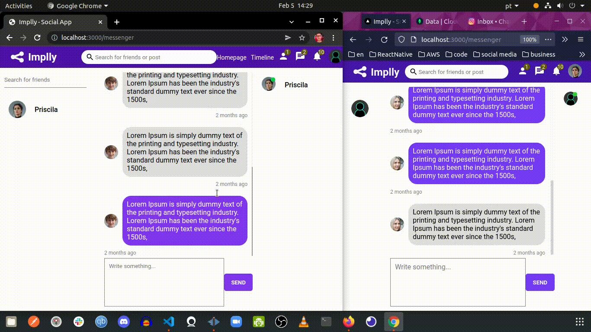

<h1 align="center">
   
</h1>
  

  <h1>Implly - Everybody has something <b>GOOD</b> to <b>SHARE</b> </h1>

  <a href="#about-the-project"> About </a> &nbsp;&nbsp;&nbsp;| &nbsp;&nbsp;&nbsp;
  <a href="#realtime-chat">Realtime chat</a> &nbsp;&nbsp;&nbsp;|&nbsp;&nbsp;&nbsp;
  <a href="#application-features">Gifs</a> &nbsp;&nbsp;&nbsp;|&nbsp;&nbsp;&nbsp;
  <a href="#getting-started">Getting started </a> &nbsp;&nbsp;&nbsp;|&nbsp;&nbsp;&nbsp;
  <a href="#techs">Techs</a> &nbsp;&nbsp;&nbsp;|&nbsp;&nbsp;&nbsp;
  <a href="#license">License</a>

  
    
  
  

 

 

# About the project

### Implly - Everybody has something GOOD to SHARE

Application with the purpose of connecting people who have common interests to
share good contents. Just create your account and choose what your
interests are and start to have access to the best that Implly have to offer. (Not implemented yet)

 

Developed with <code>ReactJS</code>, <code>NodeJs</code>,<code>Axios</code>, <code>Express</code>, <code>Bcrypt</code>,<code>Mongoose</code>  <code>Socket.io</code> and <code>Context Api</code>  
 

#### Features:
- Register
- Login
- Post images
- Like a post
- On the home page, `the posts of the logged in user and the people he follows are fetched`
- In addition, it is possible to `follow users` and `chat in realtime` through `socket.io` 
- And finally `users who are online are shown`. 

 

## Realtime chat
 
 ### First of all, what's Socket.Io ?  
 

    Socket.io is a technology that allows you to start bi-directional communication session between the browser and the server. Thanks to this protocol it is possibility to send request to the server and receive an answer as events, what means that you don't have to re-send the request to the server.  
    
   So...For this realtime chat application with socket,basically we have a socket server whenever any user connects to the application  it's gonna connect this socket server and they will have their own socketID, and inside the server there is no DB, it's not writing any data, not reading from any db it's just connecting to your computer and using only events. By saying connecting your computer,in short way, means that the socket server use TCP/IP connection.    
  
 Let's say the user 4, `on the image below`, wants to send an event to user 3, so user 4 is going to send the sendMessage event to the server, he takes it(server) this event and say: “ok..this is a sendMessage event it came from socketID4 and the receiver is 3",for example. That way, instantly the message will be set on socket 3. So sender will be 4 and text will have the message sent.

 

## Upload image

  I used multer for this purpose, that's not a good idea, I know. I plan to later switch to Firebase or Amazon Services

# To-do lists
 
<ol>
 <li>Make the SM Responsive </li>
 <li>Add comment functionality </li>
 <li>Delete and edit posts functionality</li>
 <li>Use S3 Storage or Firebase for Upload of images instead of Multer</li>
</ol>

## Application features:

<h2>Realtime Chat With Socket.io </h2>

<h2>Post </h2>

## Getting started

1. Clone this repo using <code>git@github.com:eulazzo/socialmedia.git</code> 
2. Move yourself to the appropriate directory: <code>cd socialmedia</code>  
3. Run <code>npm install</code> to install dependencies 

### Getting started with the frontend

1. Move yourself to the frontend folder: <code>cd client</code>  
2. Run <code>npm start</code> or <code>yarn start</code> to start the web application  
a window will open, but for the data show up, we have to start the back-end server

### Getting started with the backend server

1. Move yourself to the backend folder:<code>cd api</code> 
2. Create a <code>.env</code> file and add the MongoDB url connection in MONGO_URL field
3. Now type yarn run dev, the server will start with nodemon 
4. if you dont have yarn installed, type <code> npm install --global yarn </code> on terminal to install it or just use npm instead  

### Getting started with Socket.io
1. Move yourself to the socket io folder: <code>cd socket</code> 
2. Go to socket folder and type again <code>npm start</code> for the chat message works properly  
3. now you are ready to create an account and login

## :rocket: Techs

<table>
   
  <thead>
    <th>Back-end</th>
    <th>Front-end</th>
  </thead>
   
  <tbody>
    <tr>
      <td>Node.js</td>
      <td>ReactJS</td>
    </tr>
     <tr>
      <td>Socket.io</td>
      <td>Socket.io</td>
    </tr>
    <tr>
      <td>ExpressJs</td>
      <td>CSS</td>
    </tr>
    <tr>
      <td>Axios</td>
      <td>Axios</td>
    </tr>
    <tr>
      <td>Nodemon</td>
      <td>React Hooks</td>
    </tr>
    <tr>
      <td>Cors</td>
      <td>Eslint</td>
    </tr>
    <tr>
      <td>Prettier</td>
      <td>Prettier</td>
    </tr>
  </tbody>
  
</table>

## License

This project is licensed under the MIT License - see the [LICENSE](https://opensource.org/licenses/MIT) page for details.
<!-- <h4>Techs:</h4>

  

  -->

 

 
 
